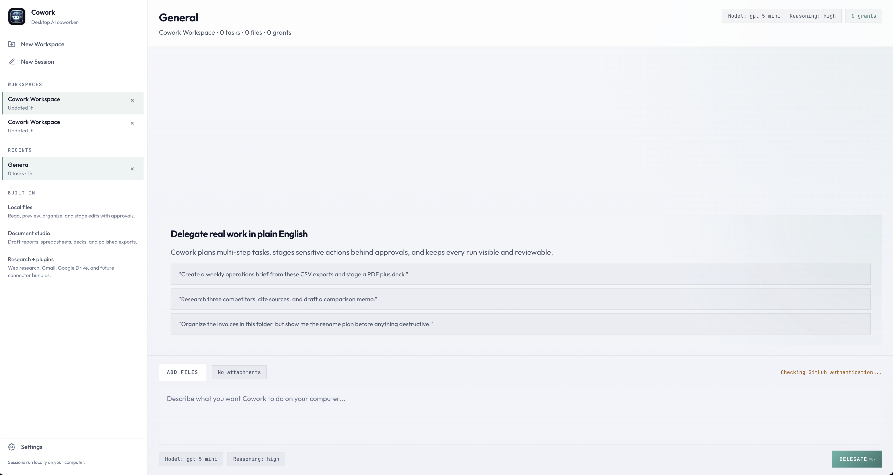

# Copilot Cowork 

Local-first Electron desktop app for a Copilot SDK powered AI coworker. It is designed for non-technical users who want to delegate real computer work in plain English, review plans before sensitive actions, and keep runs, approvals, and artifacts visible in one place.



## What It Is

Cowork is not a document chat client anymore. The app now centers on:

- Workspaces and sessions for organizing delegated work
- Task runs with structured plans, approval checkpoints, outputs, and artifacts
- Generic attachments that provide context without making files the only workflow
- A local-first runtime that keeps auth, state, and file context on the desktop

The current implementation ships the product shell, persistence model, Copilot-backed run planning, approval handling, and the new task-first UI.

## Current Capabilities

- Create and switch between workspaces and sessions
- Attach local files as session context
- Delegate a task in plain English
- Generate a Copilot-backed supervised run with:
  - run summary
  - planned workflow steps
  - approval checkpoints
  - output blocks
  - artifact cards
- Persist workspace-level permission grants for approved scopes
- Migrate legacy `Document Pilot` state into the new cowork data model

## Product Direction

The target product is a desktop AI coworker that can eventually coordinate:

- local file operations
- document generation
- sandboxed execution
- web research
- desktop automation
- plugin-based integrations

The current codebase already reflects that model in its types, storage, IPC, and UI. The next implementation slices are the real execution hosts for file work, sandbox jobs, research, desktop actions, and connector-backed workflows.

## Architecture

- Desktop shell: Electron
- Renderer: Vite + TypeScript
- Agent runtime: `@github/copilot-sdk`
- Persistence: local JSON workspace/app-state storage
- UI model: workspace -> session -> task -> run

Main flows are split across:

- `src/shared/contracts.ts` for the cowork domain model and IPC contracts
- `src/main/copilotChat.ts` for Copilot planning and approval-aware run generation
- `src/main/projectStorage.ts` for workspace/session persistence and migration
- `src/renderer/main.ts` for the task-first desktop UI

## Setup

0. Use Node.js 24+ because `@github/copilot-sdk` requires `>=24.0.0`.
1. Install dependencies:

```bash
npm install
```

2. Ensure GitHub Copilot CLI is installed and authenticated. The app checks auth at startup and blocks task delegation until Copilot is available.

3. Optional environment variables:

```bash
export COPILOT_MODEL=gpt-5-mini
export COPILOT_LOG_LEVEL=error
```

## Run

```bash
npm run dev
```

## Build

```bash
npm run build
```

## Verification

```bash
npm run typecheck
npm run build
```

## Notes

- The current runtime returns supervised run packages rather than executing every real-world side effect yet.
- Approval handling is already modeled in the UI and persistence layer, including workspace-level grants.
- Legacy document-analysis messaging and chart-specific behavior are no longer the primary product path.
